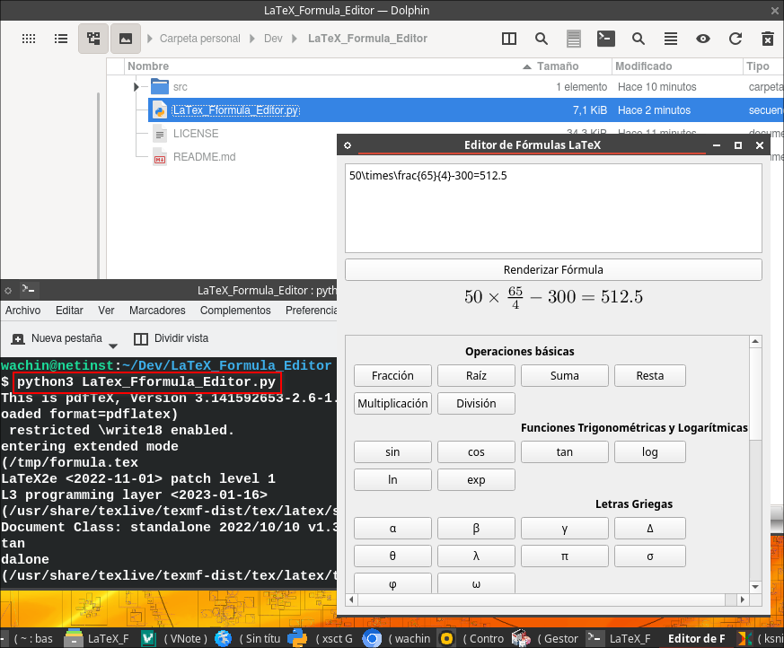

# LaTeX_Formula_Editor

Para que este programa funcione correctamente, necesitas algunos paquetes adicionales y configuraciones en tu sistema. 

### 1. Requisitos previos

Este programa está escrito en Python y usa la biblioteca PyQt6 para la interfaz gráfica y ha sido creado en Debian 12 por lo que debe funcionar en MX Linux 23, antiX 23 y otros. Además, se necesita que tu sistema tenga instalado `pdflatex` y `ghostscript` para procesar y renderizar las fórmulas en LaTeX. Necesitas tener más de 600 MB de espacio disponible


### 2. Instalación de dependencias

Python 3 debe venir en tu distribución, instala estos paquetes usando los siguientes comandos (para sistemas basados en Debian, como Ubuntu y MX Linux):

```bash
sudo apt update
sudo apt install git python3-pyqt6 python3-matplotlib python3-pillow ghostscript texlive-latex-base texlive-latex-extra
```

`texlive-latex-base` contiene `pdflatex`, que es necesario para compilar el código LaTeX, y `ghostscript` permite convertir los archivos PDF generados a imágenes PNG.


### 3. Ejecutar el programa

Puedes clonar el repositorio:

```
git clone https://github.com/wachin/LaTeX_Formula_Editor
```

Para ejecutar el programa, abre una terminal allí y usa el siguiente comando:

```bash
python3 LaTex_Fformula_Editor.py
```

### 4. Uso del programa

Al abrir el programa, verás una ventana titulada "Editor de Fórmulas LaTeX" con los siguientes elementos:

1. **Editor de LaTeX**: En el campo de texto grande, puedes escribir cualquier fórmula en formato LaTeX. Ejemplo:

```latex
\frac{a}{b} + \sqrt{x} = y
```
   
u otro ejemplo:

```latex
50\times\frac{65}{4}-300=512.5
```




2. **Botón "Renderizar Fórmula"**: Después de escribir tu fórmula en LaTeX, haz clic en este botón para procesar y renderizar la fórmula. Si todo está correcto, verás la fórmula renderizada en forma de imagen.

3. **Área de visualización de la fórmula renderizada**: Aquí se mostrará la imagen de la fórmula renderizada después de hacer clic en "Renderizar Fórmula".

4. **Etiqueta de errores**: Si hay algún error al procesar la fórmula (por ejemplo, si la fórmula contiene un error de sintaxis en LaTeX), verás un mensaje en rojo en esta sección.

5. **Panel de botones para insertar símbolos**: El programa incluye un panel de botones que te permite insertar símbolos y expresiones de LaTeX comunes en el editor de manera rápida. Este panel está organizado en categorías como "Operaciones básicas", "Letras Griegas", "Funciones Trigonométricas", etc.

   - Para insertar un símbolo, simplemente haz clic en el botón correspondiente, y el código LaTeX del símbolo aparecerá en el editor.

### 5. Ejemplo de uso

1. Escribe una fórmula como `\frac{1}{x} + \sqrt{y} = z`.
2. Haz clic en "Renderizar Fórmula".
3. La fórmula se mostrará en la sección de visualización.
4. Si hay un error en la sintaxis, un mensaje de error aparecerá en la etiqueta de errores.

### 6. Resolución de problemas

- **La fórmula no se renderiza**  
  Verifica que el código LaTeX esté bien escrito. LaTeX es sensible a errores de sintaxis. Si el error persiste, revisa los mensajes en la etiqueta de errores para obtener más información.

